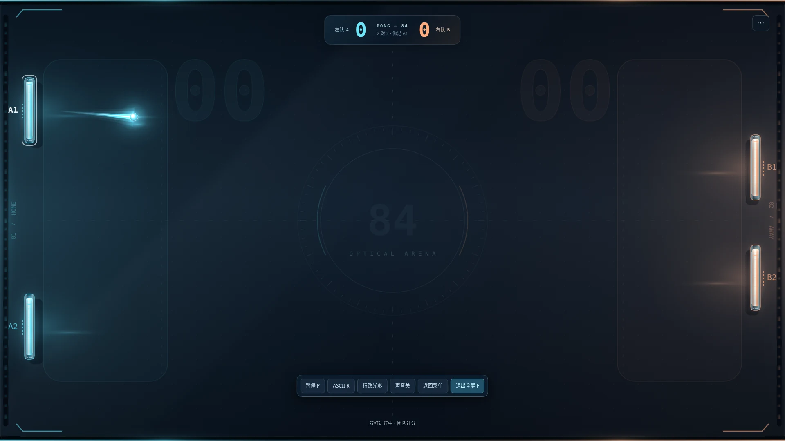
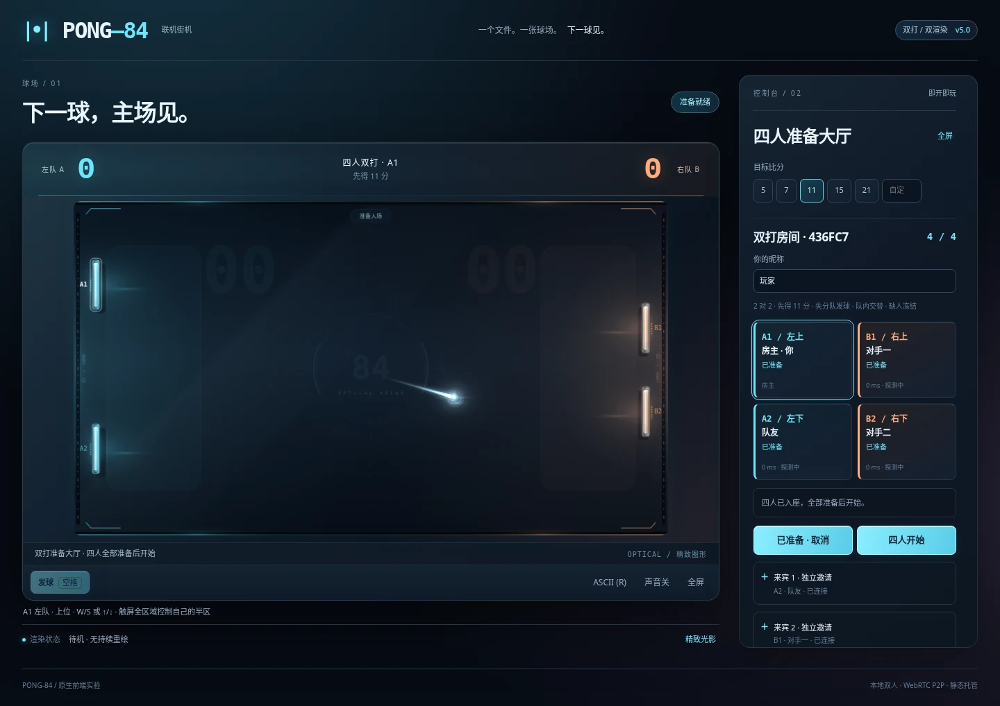

# PONG-84 · 四人双打

一份 HTML，一张 16:9 球场。精致光影与独立 ASCII 双渲染，支持本地游戏、双人联机和四人团队双打。

**当前版本：5.0.0 · 四人双打首版。** 双打游戏规则、大厅、多连接管理及恢复协议已实现；已完成自动化界面、物理、模拟四端协议和原生 SDP 检查。**尚未完成四台实体设备、公网 PeerJS 或 TURN 的端到端联机验收。** 具体方法与环境限制见 [测试报告](TEST_REPORT.md)，不能把模拟传输结果等同于公网连通保证。



> 截图来自浏览器中的固定测试场景，不是实际联网对局截图。

## 直接游玩

下载 `index.html`，用支持 WebRTC 的完整浏览器打开；也可以部署成静态网站。游戏本身不需要 Node.js、Python、安装程序或游戏服务器。

低配置设备直接打开 **`ascii_start.html`**。这是完整、独立的 HTML，启动时强制进入 ASCII，不需要先加载图形场景再切换。运行中仍可按 **R** 切回图形。

本版测试环境的浏览器策略禁止 `file://` 导航，因此这里的“本地打开”是程序入口设计，**不是本次环境已完成的文件 URL 实测结论**。浏览器内置预览器、聊天软件预览器及受管理浏览器可能限制 JavaScript、WebRTC 或全屏；请使用完整浏览器并按其错误提示处理。

## 游戏模式

| 模式 | 人数与操作 | 计分 |
|---|---|---|
| 人机对战 | 一名真人对 AI，可选择难度 | 目标分 |
| 本地双人 | 同一设备，左右分别控制 | 目标分 |
| 计时赛 | 同一设备双人对战 | 计时结束比较比分 |
| 联机对战 | 两台设备；手动 P2P 或四位云房间码 | 目标分 |
| **四人双打** | **四名真人、四台设备、2 对 2** | **团队目标分** |

## 四人双打规则

左队为 **A1（上位）／A2（下位）**，右队为 **B1（上位）／B2（下位）**。每人只控制自己的球拍，上位和下位分别守住球场的一半。队友球拍不能穿越或重叠，中间的水平虚线只是分区提示，不会阻挡球。

四人共用一颗球。球越过某队底线，对方团队得分。每人初始球拍高度为 80 逻辑单位，键盘移速为 1100 逻辑单位／秒；球场为 960 × 540。球拍高度属于首版平衡参数，尚未通过大规模实战调校。

开局随机确定发球方与队内首个发球员；此后由失分队发球，同队两名玩家轮流发球。只有画面标注的席位可以发球。空格长按、重复网络请求或错误席位请求不会重开对局，也不会重复发球。

功能球沿用高频生成；全场只有一个计时器。长拍随机作用于一名玩家，不能越出所属半区。连续得分按团队累计，护盾为整队共享的一层，不给两名队员分别叠加。首版不使用 AI 补位。

### 大厅与准备

进入 **四人双打**，先选择网络范围和连接方式，再创建或加入房间。

房主负责比赛计算，但可以坐在任意席位，不固定为左上。玩家可点击空位换位；点击他人席位会提出交换请求，需要对方同意。换位、目标分修改会取消准备状态，修改后需重新准备。

**四个席位全部连通、状态同步、页面在前台并已准备，房主才能开始。** 开始前还有一次状态确认和倒计时。比赛中不接受第五人、观战者或新玩家直接替换已有席位。比赛结束后，可留在房间重新准备。



## 联机方法一：手动 P2P

适用于希望直接打开 HTML、不依赖自动信令服务的场景。同一网络选择“同一局域网”；不同网络选择“跨网络”，必要时填写有效 TURN。

1. 房主在四人双打中创建手动房间，会出现 **来宾 1、来宾 2、来宾 3** 三张独立连接卡。
2. 房主分别生成三份邀请，每份只发给对应的一名来宾。
3. 来宾选择加入，粘贴收到的邀请，生成回应并发回房主。
4. 房主在**原来的那张来宾卡**中粘贴回应并确认。三人均连接成功后，各自选位、准备，再由房主开始。

连接码支持复制、保存为文件和从文件读取。重新生成来宾 3 的邀请不会清理来宾 1、来宾 2；旧邀请和对应旧回应会失效。连接卡编号与球场席位不同：来宾 1 可以换到 B2，不需要重新联网。

四人码以 `P84D4.` 开头，不能与双人联机的旧连接码混用。所有人应使用同一版本。生成邀请和回应后保持标签页打开，不要在交换过程中刷新。

**“手动”替代的是自动信令，不保证穿透任何网络。** 同一局域网模式不加载 PeerJS、不请求外部 STUN/TURN；路由器客户端隔离、防火墙或浏览器策略仍可能阻止连接。跨网络时 STUN 用于发现网络地址，无法直连时需要 TURN 中继。一个 HTML 文件不会凭空提供 TURN 服务。

## 联机方法二：四位云房间码

在四人双打中选择云端方式。房主创建房间后，将同一个四位房间码告诉另外三人，三人分别输入加入。然后仍需四人准备、房主开始。

此方式按需加载 PeerJS 组件，使用公共或自建 PeerServer 做信令；比赛由房主浏览器计算，不由信令服务代算。双打与单打使用不同房间命名空间，即使四位数字相同也不是同一房间。

高级网络设置可配置房间分组、PeerServer 地址、端口、路径、安全信令，以及 STUN/TURN 与强制中继。四人必须选择一致的信令入口和房间分组。对于实际需要中继的连接，参与端都应配置可用的 TURN。四人房间的三条链路可能分别为直连或中继，大厅和诊断区按玩家显示状态。

## 暂停、掉线与恢复

任何玩家可请求暂停；恢复由房主执行，要求四人恢复在线和前台状态。进入后台会冻结比赛，避免房主物理停止后其他玩家仍误以为比赛在继续。重新进入比赛前会发送完整状态并倒计时。

确认玩家掉线后，保留原席位 **30 秒**。球、比分、发球权和道具计时均被冻结。云端来宾可用“重新连接原席位”；手动模式需要房主在原来宾连接卡重新生成邀请，与原来宾再交换一次回应。重连依赖原标签页内存或该标签页会话存储中的恢复令牌；没有有效令牌的其他人不能接管保留席位。

超过宽限期、玩家主动退出或房主无法恢复，本局标记为中断，不自动判负、不自动补 AI，也不自动迁移房主。标签页关闭、存储被清理或浏览器禁止会话存储时，恢复可能不可用。旧席位记录无法恢复时，使用“清除重连记录”再重新加入，或由房主释放掉线席位后开始新局。

## 操作与画面

| 操作 | 按键／方式 |
|---|---|
| 人机、在线单打、在线双打移动 | W / S 或 ↑ / ↓ |
| 同机双人移动 | 左拍 W / S；右拍 ↑ / ↓ |
| 在线发球 | 当前发球席位按空格或回车；触屏拖动后松手 |
| 同机双人发球 | 左方空格；右方回车 |
| 暂停 | P 或暂停按钮；双打由房主恢复 |
| 切换渲染 | R 或图形／ASCII 按钮 |
| 全屏 | F 或全屏按钮；也可使用浏览器退出操作 |

移动端竖屏显示可关闭的横屏建议。双打将整个有效触控区映射到自己的上／下半区，而不是让半个屏幕失效；黑边不计入球场坐标，取消触控不会发球。

**精致图形**保留光学球场、金属／玻璃球拍、柔和光带、粒子和得分反馈，并增加四席位标识、本人描边、上下位端部纹样。**ASCII**用持久化文本行绘制，冷启动不创建 Canvas、WebGL 或 WebGPU 上下文；不生成图形拖尾，切回字符后释放图形缓存。

各端可独立选择图形或 ASCII、画质和绘制帧率，不影响比赛规则。降低绘制帧率不降低物理球速。没有 GPU 不等于任意 CPU 都能保证恒定 60 FPS；本版没有给出四台真实低配置设备的帧率承诺。

全屏调用浏览器原生 API，球场始终以 **16:9 等比居中**，不拉伸、不裁切；非 16:9 屏幕留黑边。浏览器拒绝全屏时显示说明，不用窗口内放大冒充全屏。

## GitHub Pages 部署

将本目录的文件上传到仓库，确保根目录存在 `index.html` 和 `.nojekyll`，不要只上传 ZIP。普通发布不需要运行构建脚本。

仓库 **Settings → Pages → Deploy from a branch → main / (root) → Save**。分支名按实际仓库选择；部署完成后使用 Pages 显示的网址，并开启 HTTPS。只发布游戏时，保留 `index.html`、`ascii_start.html` 和 `.nojekyll` 即可；发布 README 预览图则一并上传 `screenshots/`。

GitHub Pages 只托管静态前端，不托管 PeerServer、WebSocket 信令或 TURN。手动交换码可以继续使用；自动房间码需要可达的公共或自建信令；部分跨网络连接需要中继。公开运营时，长期密钥应留在受控后端，由后端签发短期 TURN 凭据，不能写进公开仓库。

## 故障排查

| 现象 | 检查方向 |
|---|---|
| 生成邀请提示没有可用连接地址 | WebRTC 权限／浏览器策略、防火墙、网络范围、TURN；没有地址就不会返回一个看似可用的邀请 |
| 回应不属于来宾卡 | 来宾编号、邀请是否被重新生成、是否混用单打与双打码 |
| 云房间不存在或组件加载失败 | 四人／双人模式是否一致，组件 CDN、信令服务可达性、房间分组和版本 |
| 找到房间但通道连接超时 | ICE 连通性、局域网隔离、NAT 和 TURN，不只检查房间码 |
| 四人都在但开始／继续按钮不可用 | 每人的准备、前台、连接、同步状态；等待未完成的换位确认 |
| 原席位无法恢复 | 原标签页、会话令牌、30 秒宽限期；清除失效记录后重新加入新局 |

诊断区只展示必要网络状态，不导出 TURN 密码或席位恢复令牌。公开提问时不要贴完整 SDP、邀请回应、密码或恢复令牌。

## 开发与验证

```text
index.html                 # 可直接发布的完整游戏
ascii_start.html           # 独立 ASCII 冷启动入口
src/base.html              # 本次改造的 16:9 光学版基线
src/room.js                # 三链路房间、身份、信令与恢复
src/game_d4.js              # 双打物理、发球、同步与预测
src/ui_d4.js                # 四席位大厅、提示与恢复界面
src/d4.html + d4.css        # 双打布局和样式
tools/build.py            # 标准库构建；输出以上两个 HTML
tools/regression.py       # 原有模式回归
tools/test_bridge.py      # 四上下文模拟传输协议测试
tools/test_native.py      # 原生 SDP / 通道配置及防护检查
tools/test_extras.py      # 双打 UI / 全屏 / 触控检查
validation/                # 此次实际测试记录
TEST_REPORT.md             # 方法、通过项和未验证范围
```

从仓库根目录运行 `python tools/build.py` 可重建发布 HTML，无第三方构建依赖。不要单独编辑发布 HTML 后再构建，否则修改会被覆盖。模块以明确的构建补丁接入基线；基线变更导致匹配失败时，构建会停止而不是静默丢弃改动。

自动化测试需要 Python、Playwright 和 Chromium，不是游玩依赖：

```bash
python -m pip install -r requirements-dev.txt
python -m playwright install chromium
python tools/regression.py
python tools/test_bridge.py
python tools/test_native.py
python tools/test_extras.py
python tools/test_release.py
```

脚本优先使用 `PONG_BROWSER` 环境变量指定的浏览器，其次查找系统 Chromium／Chrome，否则使用 Playwright 安装的浏览器。主要测试使用 `page.set_content` 注入 HTML，不以此证明文件 URL 已验证。`test_release.py` 另记录一次真实文件 URL 导航的成功或失败；提供单独 HTML 路径作为参数时，还会校验它与包内入口是否一致。模拟桥会人为丢弃部分实时消息，但不模拟完整网络拥塞、NAT 或真实设备性能。

### 同步结构

房主权威计算，另外三端只发输入。主机固定步长 240 Hz，输入／状态默认 60 Hz；积压时单独降低某条链路的快照发送，不改变物理速度。本人球拍预测并由逐人输入确认校正，其他球拍与球用短快照缓冲平滑显示；碰撞和发球等离散事件切换不跨事件插值。

控制消息可靠有序；实时通道使用原生 `ordered:false, maxRetransmits:0`。云模式的实时通道也明确创建为原生数据通道，而不是只依赖 PeerJS 的 `reliable:false` 参数。比分、回合编号、身份、输入和快照均有边界检查，但**这是好友联机架构，不是竞技级反作弊系统**：房主仍有本地延迟优势，也能修改自己的代码。

## 首版边界

四人双打只支持四人四设备、上下分区、一颗球。尚未实现同机两人加入同一房间、前后阵型、观战、AI 补位、自动匹配或房主迁移。原有单打网络逻辑保持独立，没有宣称已经为旧模式同步实现四人版的全部恢复机制。

## 技术资料

- [GitHub Pages 静态托管说明](https://docs.github.com/en/pages/getting-started-with-github-pages/what-is-github-pages)
- [WebRTC 连接协商](https://webrtc.org/getting-started/peer-connections)
- [MDN：数据通道配置](https://developer.mozilla.org/en-US/docs/Web/API/RTCPeerConnection/createDataChannel)
- [MDN：发送缓冲量](https://developer.mozilla.org/en-US/docs/Web/API/RTCDataChannel/bufferedAmount)
- [PeerJS 项目与其许可证](https://github.com/peers/peerjs)

## 许可证

本项目采用 [GNU General Public License v3.0](LICENSE)（GPL-3.0）授权，仓库根目录的 `LICENSE` 文件为完整许可证文本。你可以自由使用、修改和分发本项目，但以任何形式发布的修改版本或衍生作品必须基于相同许可证保持开源；云端功能按需使用的第三方组件遵循其各自许可证。
