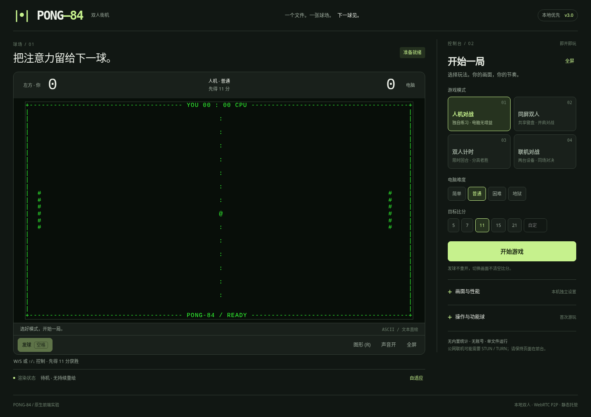

# PONG-84

**一个文件，一张球场。** 纯前端双人街机游戏，提供 CPU 友好的 ASCII 字符球场、本地人机、同屏双人、计时赛，以及手动 WebRTC P2P / 云房间联机。

新版采用「球场 + 控制台」界面：桌面左右分栏，手机竖屏上下排布，横屏对局自动收起控制台。首次进入默认使用 ASCII；图形模式可以随时切换。



## 开始游戏

直接使用完整浏览器打开 `index.html`，选择模式并点击 **开始游戏**。本地人机和同屏游戏不需要安装依赖、构建项目或启动服务器。

也可以将本仓库发布到 GitHub Pages；操作见 [部署与联机说明](DEPLOYMENT.md)。聊天软件内置的 HTML 预览不等同于完整浏览器。

| 模式 | 玩法 |
| --- | --- |
| 人机对战 | 玩家控制左拍，四档电脑难度；电脑不获得功能增益。 |
| 同屏双人 | 两人共用一块键盘或触屏；目标比分支持预设与 1–99 自定义。 |
| 双人计时 | 30 秒 / 1 分钟 / 2 分钟，以有效对打时间计时，时间到分高者胜。 |
| 联机对战 | 两台设备，手动 P2P 或 4 位云房间码；房主控制左拍并负责物理与比分。 |

## 操作

| 操作 | 按键 / 手势 |
| --- | --- |
| 人机或联机中控制自己的球拍 | `W / S` 或 `↑ / ↓` |
| 同屏双人 | 左方 `W / S`；右方 `↑ / ↓` |
| 人机或联机发球 | 轮到自己时按空格或回车，或点击「发球」 |
| 同屏双人发球 | 左方空格；右方回车；也有各自的发球按钮 |
| 本地暂停 / 继续 | `P`；退出全屏后也可使用 `Esc` |
| 切换 ASCII / 图形 | `R` 或球场下方按钮 |
| 全屏 | `F` 或「全屏」按钮 |
| 触屏 | 上下拖动，松手发球；同屏双人各用半边球场 |

空格不会重新点击隐藏的开始按钮；长按发球键不会重置对局。切换画面、颜色、性能档位或音效不会清空比分、发球权和当前功能效果。触控被取消或丢失捕获时不自动发球。

## ASCII 与低配置设备

ASCII 是实际的字符绘制，不是把图形画面转成字符的滤镜。

- 默认路径不创建 Canvas 上下文，字体测量也不使用 Canvas；不使用 WebGL / WebGPU。
- 使用固定上限的字符网格、复用字节缓冲区和长期存在的文本节点，仅写入发生变化的行。
- 字符模式不生成拖尾，不运行 CRT 扫描线、噪声、模糊、发光、闪烁或连续 CSS 动画。
- 菜单与暂停状态按需重绘，不保持持续游戏帧循环。本地游戏切到后台会暂停，回到前台后由玩家继续。
- 图形路径延迟初始化，使用固定 `960 × 540` 画布；切回 ASCII 后画布缩到 `1 × 1`，不再调用图形绘制。

在控制台展开 **画面与性能**，或点击球场下方的性能档位按钮：

| 档位 | 目标刷新率 | 普通尺寸 ASCII 网格 | 紧凑尺寸 ASCII 网格 |
| --- | --- | --- | --- |
| 自适应 | 优先 60，持续高负载时降到 30 | 96 × 32 → 80 × 26 | 64 × 22 |
| 60 帧 | 60 | 128 × 40 | 80 × 26 |
| 30 帧节能 | 30 | 80 × 26 | 64 × 22 |

紧凑尺寸按球场实际宽度小于 520 CSS 像素判断。为避免频繁切档，自适应降档后不会自行反复升档；再次选择「自适应」可重试高档。性能档位仅调整绘制，物理仍使用 `1/240` 秒固定步长，玩家键盘基础移速仍为 `1100` 世界单位/秒。

**不依赖 GPU 加速不等于对任意设备承诺锁定 60 FPS。** CPU、浏览器、窗口尺寸及其他进程仍会影响体验。该版本完成了禁用 GPU 合成、加速 Canvas、WebGL / WebGPU 的 Chromium 软件渲染测试，普通负载和 6 倍 CPU 节流工况均约 60 次画面提交/秒；节能档约 30 次/秒。结果、测试口径与局限见 [性能说明](PERFORMANCE.md)。

球场下方的「渲染状态」和设置中的性能详情显示本机采样。提交次数不是显示器实测帧率；脚本耗时不包含浏览器排版、绘制或显示延迟。

## 功能球与公平性

功能效果自动出现，无需拾取。首次等待约 1–2 秒，效果结束或清除后下一次等待约 1.5–3 秒；只在实际对打时推进相关计时。变轨触发概率保留为 24%。

| 字符 | 含义 |
| --- | --- |
| `@` / `#` | 常规球 / 球拍 |
| `*` / `o` | 加速 / 减速 |
| `O` / `.` | 大球 / 小球 |
| `~` / `%` | 变轨 / 旋转 |

长拍直接延长相应球拍。连得 3 分可获得抵挡一次失分的护盾。

人机模式中，长拍只给玩家，电脑不能获得护盾或额外移速；电脑回球不继承玩家的加速、旋转或变轨强化。加速、小球只在攻向电脑时生效；减速、大球只在回向玩家时生效。双人和联机模式允许双方获得功能效果。

## 两种联机方式

进入 **联机对战** 后选择一种方式。

**手动 P2P：** 双方选择相同的网络范围。房主点击「我是房主 · 生成邀请」，将邀请码交给加入者；加入者粘贴后生成回应码，发回房主；房主确认回应，连接成功后开始游戏。支持复制连接码、保存为文件和从文件读取。

**4 位房间码：** 房主创建云端房间，加入者输入 4 位码。此模式按需加载外部 PeerJS 组件并使用信令服务；可以在高级设置里配置自建信令。双方应使用相同服务和房间分组。

手动交换连接码替代信令服务器，不会取消网络连通要求。手动 P2P + 同一局域网不使用外部信令、STUN 或 TURN，但设备仍必须能够互通。跨网络可能需要 TURN 中继。GitHub Pages 只托管前端，不能自动解决网络穿透。[WebRTC 官方说明](https://webrtc.org/getting-started/peer-connections)

联机时请保持页面在前台；浏览器可能限制后台标签页的帧调度。主机进入后台不等同于双方约定暂停。本次 UI 更新没有完成跨设备公网、公共 PeerJS 或 TURN 的端到端实测，不能据此保证任意两种网络之间都能联机。

## 隐私与安全

本项目没有内置统计脚本、账号系统或广告。游戏和显示偏好在浏览器允许时保存在本机；禁用本地存储也不妨碍基础游戏。

云联机涉及外部组件与信令服务；跨网络 STUN / TURN 也涉及外部网络基础设施，不能视为完全离线。4 位房间码不是密码；连接码仅发送给本次对手。不要将长期 TURN 密码、服务商 API 密钥或其他私密配置提交到公开仓库。高级网络配置沿用当前标签页内存保存方式。

## 项目结构

```text
index.html                 游戏、样式、物理、渲染、联机与控制台
.nojekyll                  静态发布标记
README.md                  项目与使用说明
DEPLOYMENT.md              GitHub Pages 及两种联机说明
PERFORMANCE.md             渲染设计、软件渲染测试及测量口径
TEST_REPORT.md             回归结果与未验证范围
CHANGELOG.md               本次改动
LICENSE                    GPL-3.0 许可证全文
screenshots/desktop.png    新版实际界面
validation/                原始测试结果，不参与游戏运行
tools/benchmark.py         可选的本机性能测试脚本
```

全部核心游戏逻辑在单个 HTML 中。手动联机与本地游戏不依赖外部 JavaScript 库；只有云房间在使用时才加载 PeerJS。

开发调试时，可在控制台执行 `PONG84.diagnostics()` 查看渲染、帧循环和连接状态摘要；该摘要不包含 TURN 凭据。修改物理时应同步检查高速碰撞、发球和联机快照，不能为了降低绘制负载而改变判定规则。

## 验证与限制

本次完成 **53 项回归检查 + 4 项负载 / 后台事件检查**。具体结果见 [测试报告](TEST_REPORT.md)。浏览器容器无法提供可用的 WebRTC 连接地址，原生联机测试停在邀请生成阶段；该尝试不计入通过项。没有将软件渲染测试冒充真实旧电脑、实体手机或公网双设备测试。

## 许可证

本项目采用 [GNU General Public License v3.0](LICENSE)（GPL-3.0）授权，仓库根目录的 `LICENSE` 文件为完整许可证文本。你可以自由使用、修改和分发本项目，但以任何形式发布的修改版本或衍生作品必须基于相同许可证保持开源；第三方组件遵循各自的许可证。
