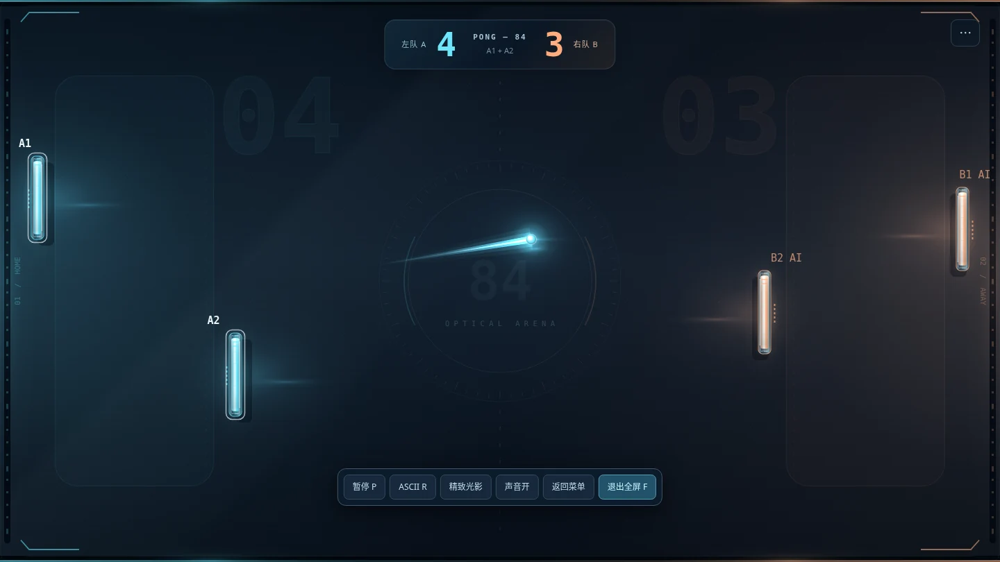

# PONG-84 · 团队 AI 对等增强版

浏览器中的单文件乒乓对战游戏：精致光影与 ASCII 双渲染、双人单打、四席位团队双打、同机组队、观众席与 AI 补位。

**发布版本：6.1.0 · 团队协议：v3。** 所有参赛者和观众均需更新；请重新创建房间和邀请，不与团队协议 v1/v2 混用。旧版本房主会撤销 AI 增益，因此本版对团队协议进行隔离；原有单打玩法不受影响。

> 自动房主迁移为实验性功能：需要预先建立备用链路，并获得原投票组的多数确认。不是无条件、无回退的无缝切换。当前发布完成了逻辑、界面与模拟消息协议测试，尚未完成实体多设备、公网 PeerJS 或 TURN 的端到端验收。详见 [测试报告](TEST_REPORT.md)。



上图为浏览器中的固定对局场景，不是公网实战截图。

## 快速开始

直接在完整浏览器中打开 `index.html`，不需要安装游戏、运行 Node.js、启动本地服务器或执行构建。ASCII 设备可直接打开独立的 `ascii_start.html`；这个文件同样可以单独运行，不是跳转页面。

单人体验新增内容：选择 **四人双打 → 本机一人 → 开启 AI 补位 → 创建房间 → 准备 → 开始双打**。其余三席由 AI 控制，无需先联网。两人共用一台设备时选择“同机两人”，另两席可以留给 AI，或邀请另一台双人设备加入。

没有可用 WebRTC 权限或网络连通条件时，本地人机和同机玩法仍可运行；网页打开不代表公网联机已经接通。推荐先在同一可互通局域网中检查真实设备连接。

## 游戏模式

| 模式 | 内容 |
| --- | --- |
| 人机对战 | 一名真人对电脑，保留原有难度与电脑无增益约束 |
| 本地双人 | 两人在同一设备上左右对战 |
| 双人计时 | 按指定比赛时长结算 |
| 联机对战 | 原有两台设备单打，手动 P2P 或云房间码 |
| 四人双打 | 四席位、左右两队、团队计分；支持 1 / 2 名本机玩家、观众与 AI |

## 团队规则

### 上下协防与前后阵型

在大厅选择阵型，开局后锁定。上下协防中 A1/B1 负责上半区、A2/B2 负责下半区。前后阵型中 A1/B1 是后卫，A2/B2 是前锋；各自在固定横向位置上下移动，活动范围为全场高度。己方出球可以穿过队友球拍，前排和后排均只拦截朝本队底线运动的来球。

四根球拍共用一颗球，以球队计分。不要求队友轮流击球。失分队发球，发球队内部交替，由界面指定席位操作；错误席位或重复请求不会发球。上下接缝的一次接触只结算一次反弹和加速。

### 同机两人

每台设备在入房前选择“本机一人”“同机两人”或“只观战”。同机两人始终加入同一队，两个席位一次分配；没有完整的同队空位时不会拆散分配。

| 操作 | 本机一人 | 同机玩家 1 | 同机玩家 2 |
| --- | --- | --- | --- |
| 移动 | W / S 或 ↑ / ↓ | W / S | ↑ / ↓ |
| 发球 | 空格或回车 | 空格 | 回车 |
| 触控 | 有效球场区域拖动 | 左半屏拖动 | 右半屏拖动 |

同机双人页面显示两个独立发球按钮。每个触控指针分别绑定一名玩家；取消触控不触发发球。全屏留边不计入触控坐标，半区阵型会将触控范围映射到对应活动区。

大厅中可交换位置；涉及其他真人的换位需要对方同意。换位或修改规则会取消相应准备。每台参赛设备点击一次准备，覆盖本机玩家。观众不需要准备。

### 观众

最多四台观众设备，整个房间最多八台设备。观众可在比赛途中加入，接收较低频率的状态并插值显示，可以独立选择图形、ASCII 与全屏。

观众不能移动、发球、暂停、改规则、准备或成为房主。退出或转为参赛只在允许的大厅状态处理，不能中途占用真人席位。房主可以通过“房间 / 邀请观众”展开连接工具，不必结束对局。原生全屏时可先退出全屏使用完整连接表单。

### AI 补位：四人模式与真人同等增益

AI 补位默认开启，可在大厅关闭。开启后自动填充空席；玩家掉线或页面不活跃时可由 AI 接管原席位。重连成功的真人在下一次发球边界收回球拍，而不是在飞行回合中抢回。

**以下新规则仅用于“四人双打 / 团队模式”，不要求四席都是真人。原有“人机对战”模式仍保留电脑无增益限制及原有难度设置。**

| 效果 | 四人模式 AI 与真人共同规则 |
| --- | --- |
| 长拍 | 四个席位等概率参与目标选择，基础高度 80 → 120；同样受所属活动区限制 |
| 回球与加速球 | AI 不再将球速压回基础值；正常击球累加、加速倍率和球速上限与真人相同 |
| 减速、大球、小球 | 不再检查击球者是否为 AI，也不再排除含 AI 的球队；共用同一颗球及效果计时 |
| 旋转、变轨 | AI 正常产生、保留和触发；击球位置、触发概率与真人相同 |
| 团队护盾 | 含 AI 的队伍同样积累三次连得分护盾；获得和消耗规则不变 |
| 身份切换 | AI 代打、真人恢复、房主迁移不因操作者身份清空长拍、连胜、护盾或当前球路 |

全局仍只有一套功能球计时器，不因人数或 AI 数量而额外生成。不增加 AI 专属道具、额外倍率或瞬移。正常的效果到期、失分和发球重置规则仍生效；例如发球边界本来就清理上一回合的临时球效果，不是为 AI 另加惩罚。

### 增强预判

AI 改为预测球到达自己球拍接触面的实际落点，而非只追踪当前球高或部分提前量。模型考虑球半径、连续上下壁反弹、旋转加速度与衰减，以及已经确定的加速 / 减速 / 大球 / 小球效果到期。普通无旋转轨迹使用常数开销解析计算；旋转或到期轨迹最多向前模拟 2.5 秒、600 个物理步。

AI 的普通决策间隔为约 **45 毫秒**，临近接球或变轨期间约 **25 毫秒**；基础移动上限从 375 提升到与真人相同的 **1100 逻辑单位 / 秒**。球拍仍按物理步连续移动并遵守半区边界，不会直接跳到预测位置。2 个逻辑单位以内的误差停止移动，避免微小抖动。

上下协防时，不属于本半区的来球不会让队友一起挤向接缝。前后阵型中，前锋和后卫分别预测各自接触面的落点；球越过前锋后，前锋不追身后的球，后卫继续准备补漏。己方出球时适度提前站位，但不假定对手的下一次操作。

**AI 不读取尚未发生的随机变轨或新道具结果。** 变轨实际发生后重新估计；临时变化、距离过短或球拍移速限制仍可能造成漏球。本版没有改变单人人机难度按钮，也没有新增四人 AI 难度选项。

关闭 AI 时，未满四席不能开局，比赛中缺人则冻结等待。身份恢复依赖当前会话或浏览器允许保存的会话恢复信息，不是永久账户。

## 两种联机方式

### 手动 P2P

双方或多方选择相同的网络范围，局域网选“同一局域网”，不同网络选“跨网络”。房主为每台加入设备分别使用一张连接卡：生成邀请 → 发给对应设备 → 该设备生成回应 → 房主在原卡确认。

**连接卡按设备计算，不按人头计算。** 两名本机队友共用一组邀请和回应；观众也需要自己的连接入口。每张卡支持复制、保存为文本和从文件读取。重新生成某张卡不会关闭其他卡。刷新、关闭或重新生成后不要继续使用旧邀请。

开启自动迁移时，已连接设备还会经房主转发信令，自动建立彼此之间的备用连接。无需人工再交换每一对设备的代码，但网络必须允许这些备用链路实际建立。

### 云端四位房间码

房主创建云端房间，其他设备选择自己的参与人数后输入同一个四位码。云模式使用 PeerJS 信令，游戏实时数据使用 WebRTC 数据通道。公共信令、脚本 CDN 与实际网络连通均需要在使用环境中验证。

迁移后，新房主会申请新的四位入口码；在线成员沿已建立的链路跟随。新观众或断线设备应使用界面显示的当前入口，不能依赖旧码永远有效。

技术与排障见 [联机和迁移说明](NETWORK.md)。

## 自动房主迁移

自动迁移默认开启。在大厅检查“备用连接”和投票设备状态，再开始比赛。无法建立完整备用链路时，可以在大厅关闭迁移继续普通联机，但将失去突然掉线时的自动接管能力。

本版使用当前房主统一计算、备份状态、心跳、多数确认与任期隔离。新房主从最近**已提交**的完整检查点恢复，可能回退短暂的最近状态；恢复包括比分、球、球拍、发球轮次和道具计时。原房主掉线席位按 AI 设置处理，确认后倒计时继续。检查点被网络积压拖延时，不能保证回退固定少于某个时间。

| 开局投票设备数 | 所需多数 | 原房主突然失联后 |
| --- | --- | --- |
| 1 | 1 | 没有其他设备，无法迁移 |
| 2 | 2 | 只剩一台时安全冻结，不能自动选主 |
| 3 | 2 | 两台仍互通且含合格玩家时可尝试迁移 |
| 4 | 3 | 三台仍互通且含合格玩家时可尝试迁移 |

两台电脑分别两人组队时，**“四个人”仍然只有两个网络投票设备**。需要应对突然掉线，可在开局前加入一台观众设备作为第三个见证节点。观众可以确认投票但不能当房主；比赛途中加入的观众从下一局才进入投票组。

房主主动离开优先点击“移交房主”或游戏内的“移交并退出”。有序移交通过旧房主授权与新房主确认，在两台设备均在线时也可执行。关闭标签页、刷新、断电不等于有序退出。

这是面向合作客户端的恢复机制，不是完整的容错共识产品或防作弊服务；任意网络分区、丢失多数、所有备用链路失败、设备同时休眠时无法承诺自动继续。

## 画面、性能与全屏

精致图形保留光学玻璃球场、金属发光球拍、光带尾迹、碰撞与得分光效，并区分本机两名队友和 AI 席位。

ASCII 是独立的 DOM 文本渲染路径：冷启动不请求 Canvas、WebGL 或 WebGPU 上下文；不只是给图形套字符滤镜。切回 ASCII 停止图形绘制并释放图形缓存。画质和帧率各端独立，主机物理固定步长不随某台客户端绘制帧率变化。

“全屏”使用浏览器原生全屏，球场保持 **16:9 等比居中**，不同屏幕比例留黑边，不拉伸。手机竖屏提示横屏，但不强制锁定方向。浏览器或系统拒绝原生全屏时会提示，不能隐藏系统安全界面。

## GitHub Pages 部署

将本包解压后的内容放到仓库根目录，而不是只上传 ZIP。运行的必要文件是 `index.html`；独立字符入口另外需要 `ascii_start.html`。附带 `.nojekyll`，可直接发布预构建文件。

在仓库 **Settings → Pages → Build and deployment** 中选择 **Deploy from a branch**，选择存放文件的分支和 **/ (root)**，保存并等待发布。部署流程以 [GitHub 官方文档](https://docs.github.com/en/pages/getting-started-with-github-pages/configuring-a-publishing-source-for-your-github-pages-site) 为准。

静态托管不会提供信令或 TURN。跨网络直连受 NAT / 防火墙限制，需要时使用有效 TURN，参见 [WebRTC 官方说明](https://webrtc.org/getting-started/turn-server)。不要把 TURN 长期密码或任何服务端 API 密钥写进公开仓库。

## 源码与开发

```text
index.html                 # 可独立运行的图形默认入口
ascii_start.html           # 可独立运行的 ASCII 默认入口
src/base.html              # 原有单打、光学渲染、ASCII、网络基础实现
src/d4.html                # 团队大厅标记
src/d4.css                 # 团队界面样式
src/room.js                # 设备/玩家、连接、观众、投票与迁移
src/game_d4.js             # 双打规则、AI、同步与检查点
src/ui_d4.js               # 团队 UI、同机输入入口
tools/                    # 构建与自动检查（运行游戏不需要）
validation/*.json          # 本次检查的原始结果
history/v6.0/             # 上一版报告，仅为历史记录
```

开发修改 `src/` 后在根目录执行：

```sh
python tools/build.py
```

构建只使用 Python 标准库。可选语法检查：

```sh
node --check validation/compiled.js
```

测试依赖与运行：

```sh
python -m pip install -r requirements-dev.txt
python -m playwright install chromium
python tools/test_team_protocol.py
python tools/test_team_ui.py
python tools/test_team_ai.py
python tools/regression.py
python tools/test_native_environment.py
```

可以用环境变量 `PONG_BROWSER` 指定本机 Chromium 可执行文件。测试使用桌面 Chromium；手机触控是模拟测试，不替代实体 iOS / Android 验证。原生环境脚本专门记录 `file://`、ICE 与实际应用邀请是否可用，不能把它的“诊断完成”当作“连接成功”。

**协议测试明确使用内存消息转发替身，不是实际 WebRTC 连通测试。** 本次 246 项自动检查包含 240 组确定性轨迹对照（轨迹组不是额外的 240 项断言），不应将这些结果解释为公网实战验收。详见 [TEST_REPORT.md](TEST_REPORT.md) 与 [PERFORMANCE.md](PERFORMANCE.md)。

## 安全与授权

不要求摄像头或麦克风。不要在公开 Issue 附件中附带完整连接码、会话恢复令牌、TURN 凭据或他人的公网地址；参见 [SECURITY.md](SECURITY.md)。

本项目采用 [GNU General Public License v3.0](LICENSE)（GPL-3.0）授权，仓库根目录的 `LICENSE` 文件为完整许可证文本。你可以自由使用、修改和分发本项目，但以任何形式发布的修改版本或衍生作品必须基于相同许可证保持开源；外部第三方服务和依赖遵循其各自条款。
